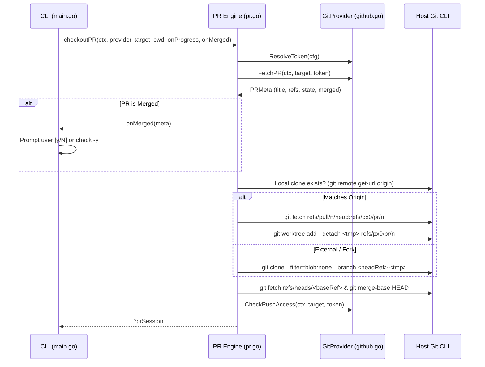

# Git Forge PR Review & Provider Architecture

This document describes the design and implementation of px0's pull request review feature: the `GitProvider` abstraction layer ([`provider.go`](../../provider.go)), GitHub REST implementation ([`github.go`](../../github.go)), checkout lifecycle and progress reporting ([`pr.go`](../../pr.go)), merge-base diffing ([`git.go`](../../git.go)), and the frontend review interface ([`web/src/pr.js`](../../web/src/pr.js), [`web/src/linecomment.js`](../../web/src/linecomment.js)).

---

## 1. Zero-Dependency, Process-Scoped Design

Two core px0 tenets shape pull request reviews:

- **Zero-dependency shell-out**: Like `git.go` (which links no Go git library), px0 avoids external forge SDKs. `github.go` uses standard Go `net/http` against the GitHub REST API, plus an optional shell-out to `gh auth token`. Checkout itself uses standard `git fetch`, `git worktree add`, or `git clone` via `exec.Command`.
- **Stateless on disk**: px0 maintains no persistent cache in `~/.px0`. A PR checkout is strictly process-scoped: `checkoutPR` (`pr.go`) places the worktree in `os.MkdirTemp("", "px0-pr-*")`, and `prSession.Close` removes it upon exit (`Ctrl+C` or normal shutdown). This ensures zero leftover disk clutter and prevents stale cache bugs.
- **In-memory draft comments**: Draft comments live in `prSession.comments` as a thread-safe, mutex-guarded slice in server memory. They never touch disk and vanish when the process exits (submitted or discarded).

---

## 2. Extensible Forge Architecture (`GitProvider`)

To support multiple git forges (GitHub, GitLab, Bitbucket, etc.) without entangling core review logic, forge interactions are abstracted behind the `GitProvider` interface in [`provider.go`](../../provider.go):

```go
type GitProvider interface {
    Name() string
    MatchURL(rawURL string) bool
    ParseURL(rawURL string) (PRTarget, error)
    ResolveToken(cfg settings) (token, source string)
    FetchPR(ctx context.Context, target PRTarget, token string) (PRMeta, error)
    CheckPushAccess(ctx context.Context, target PRTarget, token string) bool
    SubmitReview(ctx context.Context, target PRTarget, token, headSHA string, comments []prComment, event, body string) error
}
```

### Data Models
- **`PRTarget`**: Normalized identifier containing `Provider`, `Owner`, `Repo`, `Number`, and original `URL`.
- **`PRMeta`**: Standardized metadata across all providers:
  - `Number`, `Title`, `Author`
  - `State`, `Merged`, `MergedAt`
  - `Draft`
  - `BaseRef`, `HeadRef`, `HeadSHA`
  - `HeadRepoCloneURL`, `HeadIsFork`

### URL Matching & Routing
Pull requests are opened exclusively via `px0 <url>`. URL routing in `main.go` calls:
```go
provider, target, ok := DetectPRURL(arg0)
```
- Iterates over `defaultProviders` (which includes `&GitHubProvider{}`).
- If a provider matches and successfully parses the URL, px0 enters PR review mode.
- Bare numbers (e.g. `px0 123`) and file paths are never mistaken for PR targets; they are processed as regular filesystem paths.
- Running `px0 pr` outputs an explicit error guiding the user to pass the URL directly.

---

## 3. Checkout Lifecycle & Progress Narration

`checkoutPR` (`pr.go`) executes the following sequence:



### CLI Progress Narration
`checkoutPR` accepts an `onProgress func(string)` callback. In `main.go`, this drives a smooth amber `uiSpinner`:
1. `Fetching PR #... metadata from <provider>...`
2. `Fetching PR #... head and preparing worktree...` (or cloning)
3. `Computing merge base with <baseRef>...`
4. `PR #... checked out (<title>)`

### Already-Merged Confirmation
When `meta.Merged` is true:
1. `onMerged` stops the spinner.
2. In interactive terminals, it asks:
   ```text
   ! PR #123 is already merged into main  <Title>
     ? Open anyway? [y/N]
   ```
3. If the user declines (or in non-interactive environments without `-y`), `checkoutPR` returns `ErrPRMergedCancelled` and exits cleanly with code 0.
4. If `-y` or `-yes` is supplied, it logs a warning and proceeds automatically.

---

## 4. Authentication & Push Access

`GitHubProvider.ResolveToken` queries four sources in order:
1. `github.token` in `settings.json` (or via Settings modal).
2. `GITHUB_TOKEN` environment variable.
3. `GH_TOKEN` environment variable.
4. `gh auth token` (GitHub CLI session).

### Fail-Closed Push Access
`CheckPushAccess` queries `GET /repos/{owner}/{repo}` and extracts `permissions.push`. It **fails closed**: any network error, HTTP error, or missing permission field yields `false`.
- Gating: `Server.handlePRMeta` passes `writeAccess` to the frontend.
- Enforcement: `Server.handlePRSubmit` enforces push access server-side before accepting `APPROVE` or `REQUEST_CHANGES`.

### Unauthenticated Read-Only Mode
If no token is found:
- Public repository metadata, worktree creation, and diff calculation proceed normally.
- Draft comments can be created in memory and batch-applied locally with AI agents.
- The CLI banner alerts the user:
  ```text
  access: read-only (no github token: set GITHUB_TOKEN or gh auth login to submit reviews)
  ```

---

## 5. Merge-Base Diffing

Unlike standard working tree diffs that compare against `HEAD`, PR reviews compare against the commit where the PR branch diverged from the base branch (the merge-base):

```go
func gitMergeBase(root, a, b string) string
```

- When the base branch ref is fetched, `diffBase` is set to `gitMergeBase(tmp, "HEAD", baseRef)`.
- If base ref resolution fails, it gracefully falls back to `"HEAD"`.
- `Server.diffBase` propagates this ref to `gitDiffAgainst` and `gitHunksAgainst`, ensuring both gutter markers and `Cmd/Ctrl+D` views display only what the PR changes.

---

## 6. Draft Comments, Submission & Batch Apply

### In-Memory Drafts
- `GET /api/pr/comments`: Returns current drafts.
- `POST /api/pr/comments`: Appends a line comment (`Path`, `Line`, `Side`, `Body`). Allowed unauthenticated so reviewers can draft feedback locally.
- `POST /api/pr/comments/delete`: Deletes a draft by ID.

### Batch Apply with Coding Agents (`⚡ Batch Apply`)
Users can delegate all drafted PR comments directly to an AI coding agent (Claude Code, Gemini CLI, Cursor Agent, Antigravity, etc.). The agent harness receives the comments as targeted editing instructions and modifies the worktree files directly.

### Formal Review Submission
- `POST /api/pr/submit`: Requires auth token.
- Calls `provider.SubmitReview` which constructs a single review payload containing the head commit SHA, all drafted comments, and the review body/event (`APPROVE`, `REQUEST_CHANGES`, `COMMENT`).
- Clears in-memory drafts upon successful submission.

---

## 7. Frontend Integration

- **Hover Line Pencil Icon (`web/src/linecomment.js`)**:
  - Displays a subtle `✏` button when hovering over line numbers in source or diff views.
  - Clicking opens a popover offering **Leave Comment on GitHub** (drafts PR review comment) or **Leave Comment for Inline Edit** (dispatches local AI agent).
- **PR Header Bar (`web/src/pr.js`)**:
  - Renders PR number, title, author, branch refs, and draft count badge.
  - Toggles `#pr-merged-badge` (purple pill) when `meta.merged` is true.
  - Houses **⚡ Batch Apply** and **Submit Review** controls.
- **Child PR Launching**:
  - Command Palette **Git: Open Pull Request…** posts to `/api/pr/launch`.
  - Spawns `px0 -y <url>` in a new detached process on an ephemeral port.
